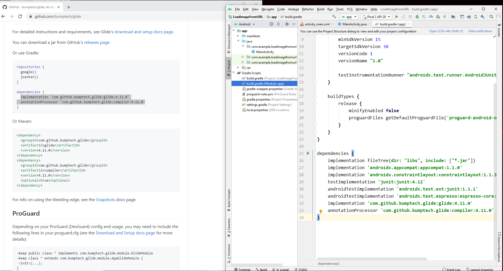

This folder contains code that:  
* Uses nested linear layout to display images.  
* Uses glide to download images from internet.  
* When a image is clicked it goes to its respective page and displays content and image.   

Following youtube video display the working of the App:  
|Image Nested Glide|
|:------------:|
|[Youtube Link](https://youtu.be/ezWsTNIhfd8)|

Adding glide depedancies to build.gradle:

