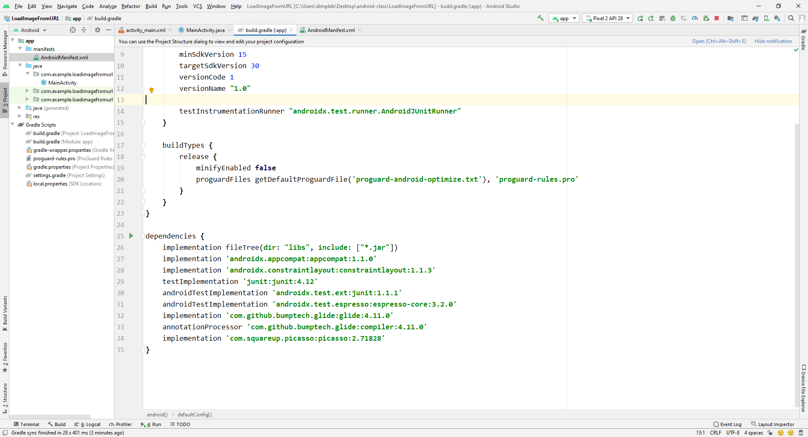

This folder contains code to load images from url.  
We will use picasso or glide application for the same.  
Following is the output:  

Layout  

Use picasso or glide to download online images  
Download  
https://github.com/bumptech/glide and copy **dependencies** part.  
https://github.com/square/picasso and copy **implementation** part. 
 
Follow lecture 26 july 2020 for this section, also picasso is the best framework.
