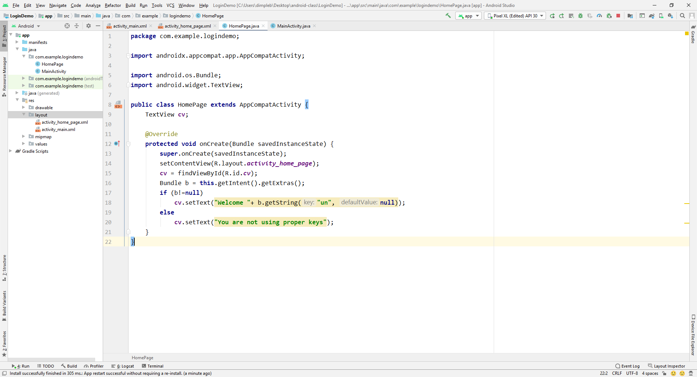

This folder contains code to create a login page.  
Using activity and intent we can navigate from one page to another.  
The steps required to create empty activity is  
`java -> com.example.logindemo -> rightclick -> New -> Activity -> Empty activity` 
Following youtube video display the working of the App:  
|Number Type App|
|:------------:|
|[Youtube Link](https://youtu.be/EVNfOwbQYIs)|

Following is the file structure  

