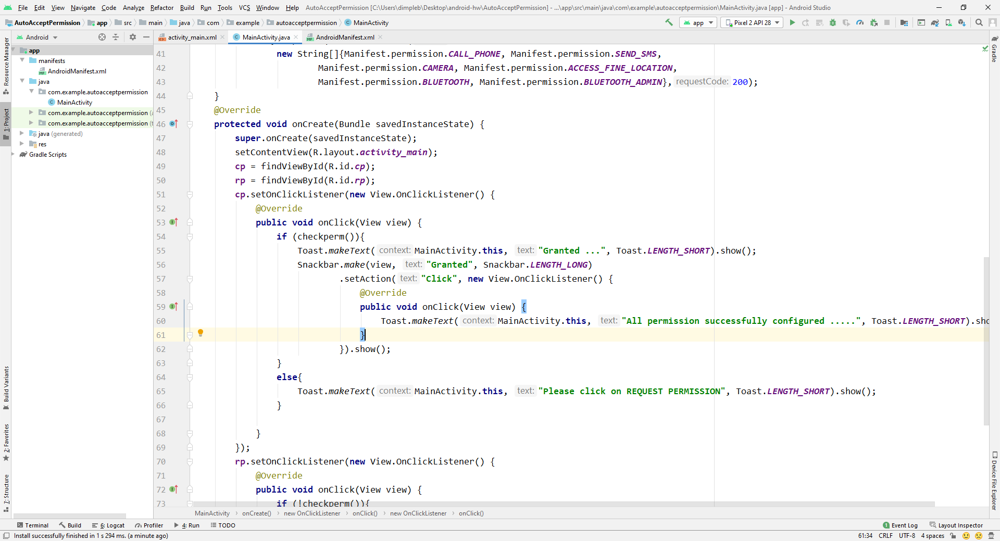

This folder contains code to accept permissions from code.  
It also includes snackbar to display message. 
 
Following youtube video display the working of the App:  
|Accept Permissions App|
|:------------:|
|[Youtube Link](https://youtu.be/_hUtUA-IuwA)|

Layout  

