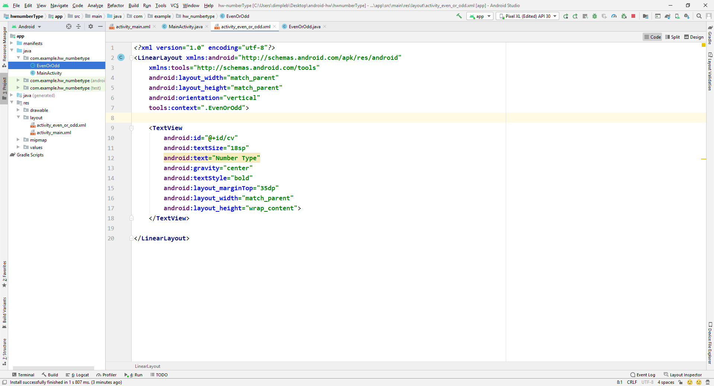

This folder contains code to check whether a number is even or odd.  
Using activity and intent we can navigate from one page to another. The number in typed in first page and result is displayed in second page. 
The steps required to create empty activity is  
`java -> com.example.logindemo -> rightclick -> New -> Activity -> Empty activity` 

Following is the file structure  

